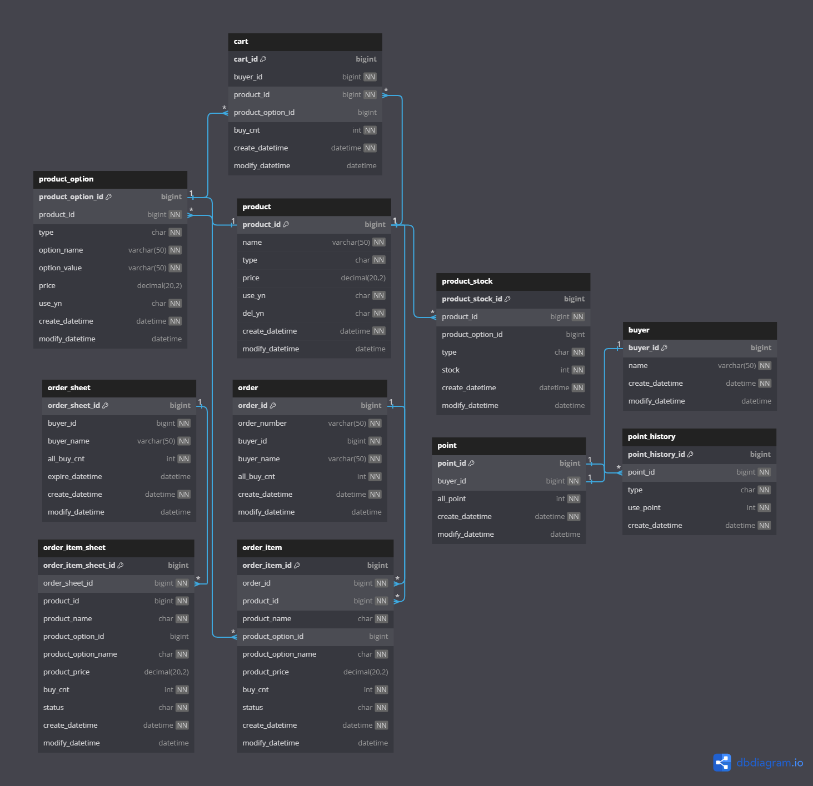

[Chapter 2] 서버구축
===========================

> 우리는 적절한 아키텍처 패턴, 클린 코드, 테스트 등을 준수하며 유지, 성장 가능한 애플리케이션을 만들어야 합니다.

목차
----
1. [Service Scenario](#Service-Scenario)
2. [Requirements](#Requirements)
3. [개발 환경 준비](#개발-환경-준비)
4. [Milestone](#Milestone)
5. [Sequence Diagram](#Sequence-Diagram)
6. [ERD 명세](#ERD-명세)
7. [API Specs](#API-Specs)
8. [API Swagger](#API-Swagger)
9. [think-about](#think-about)
---- 
Service Scenario
----------------
**e-커머스 서비스**
- **Description**
  - `e-커머스 상품 주문 서비스`를 구현해 봅니다.
  - 상품 주문에 필요한 메뉴 정보들을 구성하고 조회가 가능해야 합니다.
  - 사용자는 상품을 여러개 선택해 주문할 수 있고, 미리 충전한 잔액을 이용합니다.
  - 상품 주문 내역을 통해 판매량이 가장 높은 상품을 추천합니다.

Requirements
------------
* 아래 4가지 API 를 구현합니다.
  + 잔액 충전 / 조회 API
  + 상품 조회 API
  + 주문 / 결제 API
  + 인기 판매 상품 조회 API
* 각 기능 및 제약 사항에 대해 단위 테스트를 반드시 하나 이상 작성하도록 합니다.
* 다수의 인스턴스로 어플리케이션이 동작하더라도 기능에 문제가 없도록 작성하도록 합니다.
* 동시성 이슈를 고려하여 구현합니다.
* 재고 관리에 문제 없도록 구현합니다.
**동시에 여러 주문이 들어올 경우, 유저의 보유 잔고에 대한 처리가 정확해야 합니다.**
**각 상품의 재고 관리가 정상적으로 이루어져 잘못된 주문이 발생하지 않도록 해야 합니다.**

개발 환경 준비
--------------
- **Architecture**
    - Testable Business logics
    - Layered Architecture Based
    - (+) Clean / Hexagonal Architecture
- **DB ORM**
    - JPA / MyBatis
- **Test**
    - JUnit + AssertJ

Milestone
----------
[E-commerce 마일스톤](https://github.com/users/yjchoigit/projects/4/views/1)

Sequence Diagram
------------
- **잔액 충전**
```mermaid
sequenceDiagram
  actor 사용자
  participant 잔액
  participant 잔액내역

  사용자->>잔액: 충전 포인트 요청
  잔액-->>사용자: 충전 결과 응답 (대기)

  alt 충전 포인트 <= 0
    잔액-->>사용자: 충전 실패
  else 충전 포인트 > 0
    잔액->>잔액내역: 충전 포인트 내역 추가
    잔액내역-->>잔액: 내역 추가 완료
    잔액내역-->>사용자: 충전 성공
  end
```
----
- **상품 조회**
```mermaid
sequenceDiagram
    actor 사용자
    participant 상품
    participant 상품옵션

    사용자->>상품: 1.상품 ID로 상품 조회
    상품-->>사용자: 2.상품 정보 반환 (대기)

    alt 옵션 상품 있음
        상품->>상품옵션: 3-1-1.상품 옵션 정보 조회
        상품옵션-->>상품: 3-1-2.상품 옵션 정보 반환
        상품-->>사용자: 3-1-3.상품 정보와 옵션 정보 반환
    else 옵션 상품 없음
        상품-->>사용자: 3-2.상품 정보만 반환
    end
```
----
- **상위 상품 조회**
```mermaid
sequenceDiagram
    actor 사용자
    participant 상품랭킹

    사용자->>상품랭킹: 1. 랭킹타입 요청
    상품랭킹-->>사용자: 2. 랭킹정보 반환 (대기)

    alt 랭킹정보 리스트 수 > 3개
        상품랭킹-->>사용자: 3-1.상위 3개 랭킹정보 반환
    else 랭킹정보 리스트 수 <= 3개
        상품랭킹-->>사용자: 3-2.전체 랭킹정보 반환
    end
```
---- 
- **주문 생성**
```mermaid
sequenceDiagram
  actor 사용자
  participant 주문
  participant 상품
  participant 재고
  participant 잔액

  사용자->>주문: 1. 주문 요청

  alt 상품 조회
    주문->>상품: 2. 상품 조회
    alt 상품 정보 없음 or 사용 안함
      상품-->>사용자: 2-1. 실패 응답
    else 상품 정보 있음
      상품->>재고: 3. 상품 재고 조회
      opt 재고 확인
        재고-->>사용자: 3-1. 재고 부족 실패 응답
      end
    end
  end

  재고->>잔액: 4. 잔액 조회
  alt 잔액 확인
    잔액-->>사용자: 4-1. 잔액 부족 실패 응답
  else 잔액 충분
    잔액-->>주문: 4-2. 주문 생성 및 ID 반환
  end
  주문-->>사용자: 5. 생성된 주문 ID 반환
```
----
- **결제 요청**
```mermaid
sequenceDiagram
  actor 사용자
  participant 결제
  participant 주문
  participant 상품
  participant 재고
  participant 잔액
  participant 주문결제
  participant 상품랭킹

  사용자->>결제: 1.주문 ID로 결제 요청
  결제->>주문: 2.주문 ID로 주문 조회
  주문->>상품: 3.주문 내역의 상품 정보 조회
  상품->>재고: 4.상품 재고 조회

  alt 상품 재고 부족
    상품-->>사용자: 4-1.결제 실패 (재고 부족)
  else 재고 충분
    상품->>재고: 4-2.재고 차감
  end
  결제->>잔액: 5.사용자 잔액 조회

  alt 잔액 부족
    결제-->>사용자: 5-1.결제 실패 (잔액 부족)
  else 잔액 충분
    결제->>잔액: 5-2.잔액 차감
    주문->>주문결제: 5-3.주문 결제 내역 생성
    상품->>상품랭킹: 5-4.결제한 상품 정보 랭킹 등록 (인기순)
    주문결제-->>사용자: 6.결제 성공 여부 반환
  end
```

ERD 명세
------

API Specs
---------
[E-commerce API 명세서](https://yj16.notion.site/E-commerce-API-68acc56110924827bbd26273a9ba84a2)

API Swagger
---------
[API Swagger 캡쳐본](img_3.png)

think-about
---
* 객체지향 개발 방식으로 진행
* 동시성 제어 -> 비관적 락 사용
* Milestone, Sequence Diagram, Flow Chart, ERD 명세에 좀 더 치중해보기
* 상품, 주문의 개별, 확장 관리를 위한 엔티티 고민 (확장 가능한 엔티티 구조)
* 유닛/통합 테스트 가독성있게 작성
* 통합 테스트를 편리하게 진행하기 위할 기존의 세팅 구현 -> Setting
