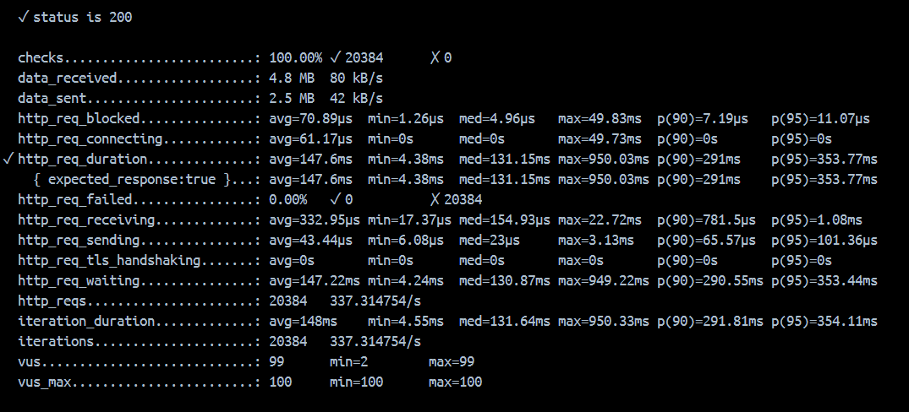
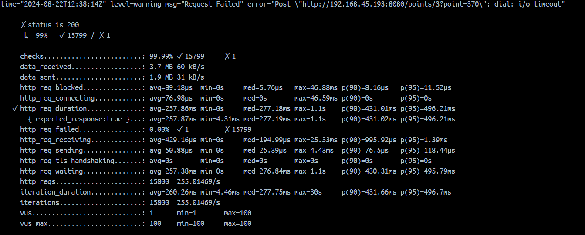
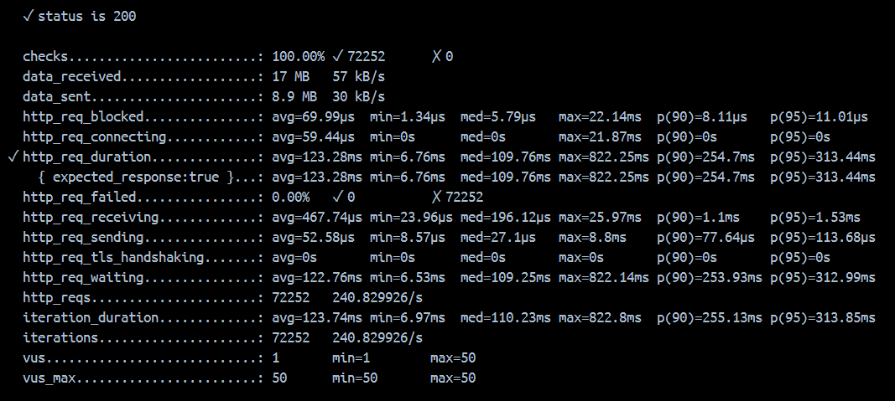
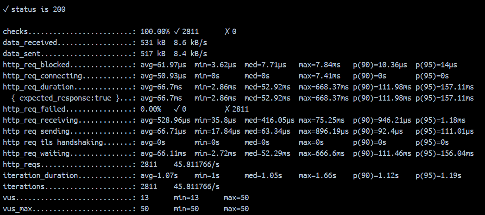
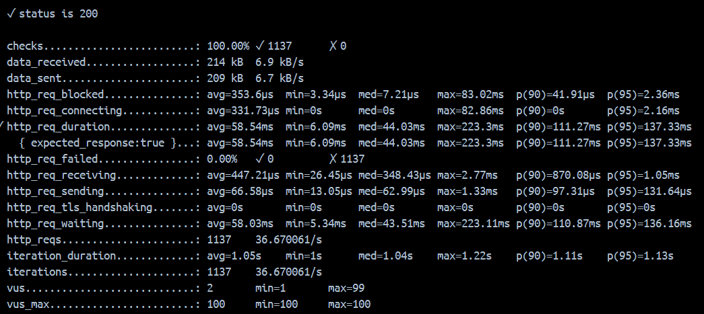
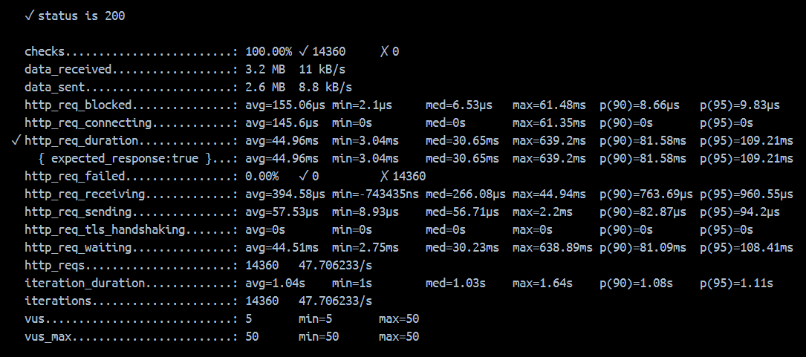

부하테스트
===========================
목차
----
1. [테스트하기 전의 생각](#테스트하기-전의-생각)
2. [잔액 시나리오](#잔액-시나리오)
3. [주문 결제 시나리오](#주문-결제-시나리오)
4. [장애 분석 및 기능 개선](#장애-분석-및-기능-개선)
5. [느낀 점](#느낀-점)
*****
테스트하기 전의 생각
-----
- 테스트 대상 선정
  - 잔액 시나리오
  - 주문 결제 시나리오
- 부하테스트를 실행하기 위한 도구 선택
  - k6
  - grafana
  - prometheus
- k6로 먼저 정상적으로 테스트가 실행되는지 확인 후, grafana와 prometheus를 이용해서 해당 테스트 결과를 시각화하기로 했다. 
- TPS, 스파이크, 부하분산을 중점으로 3가지의 테스트를 각각 실행하기로 했다.
*****
잔액 시나리오
-----
- **관련 API**
  - POST /points/{buyerId}
- **선정 이유**
  - 잔액 충전은 비즈니스 로직에서 중요한 역할을 한다. 재정적인 거래와 관련있기에 API의 성능과 안정성을 테스트하는 것이 필수적이라고 생각한다.
  - 사용자가 자주 호출할 가능성이 높은 API라고 생각 => TPS 확인 필요하다.
  - 성능 병목점 확인
    - 부하에 따른 응답시간 => 부하 증가 시 API의 응답 시간 확인 => 시스템의 취약점 발견
    - 데이터 일관성, 무결성 유지되는지 확인
  - 다른 시스템이나 서비스와 통합되어 사용할 수 있다 => 통합 시스템의 안정성과 성능을 검증하는데 좋다.
- **(1) 동시 다발적인 요청 테스트** 
  - 최대 TPS를 확인, 서버의 처리 용량 테스트
  - VU(가상 사용자) : 100명
  - 지속시간 : 1분
  ```js
  import http from 'k6/http';
  import { check } from 'k6';
  import { Counter } from 'k6/metrics';
  
  const requests = new Counter('http_reqs');
  
  export let options = {
  stages: [
  { duration: '1m', target: 100 }, // 1분 동안 100 VUs로 증가
  ],
  thresholds: {
  http_req_duration: ['p(95)<500'], // 95%의 요청이 500ms 이하
  },
  };
  
  // 검증할 url
  const baseUrl = 'http://localhost:8080/points';
  
  export default function () {
  const buyerId = Math.floor(Math.random() * 7) + 1; // 1부터 7까지의 랜덤 buyerId 선정
  const point = Math.floor(Math.random() * 1000) + 1; // 1부터 1000까지의 랜덤 잔액 선정
  
      const url = `${baseUrl}/${buyerId}?point=${point}`;
      const res = http.post(url);
  
      check(res, {
          'status is 200': (r) => r.status === 200,
      });
  }
  ```
  - **테스트 결과**
  
    - (✓ status is 200)
      - 모든 요청이 성공적으로 처리됨
    - HTTP 요청 처리 시간
      - 평균 요청 처리 시간은 147.6ms, 최소 4.38ms ~ 최대 950.03ms까지
      - (http_req_duration) 
        - 95%의 요청이 353.77ms 이하로 처리되었음  
      - 처리 성능
        - (http_reqs)
          - 초당 약 337.31개 요청 처리
          - 총 20384개 요청 처리
      - 네트워크 치연
        - (http_req_waiting)
          - 평균 147.22ms로, 서버 응답까지의 대기 시간이 포함된 평균
      - 데이터 전송
        - 총 4.8MB 데이터 수신
        - 2.5MB 데이터 전송
    - 결과 분석
      - 성공률 : 안정적으로 동작
      - 처리 성능 : TPS가 337.31로 높은 편 => 동시성 요청 처리 능력 있음
      - 응답 시간 : 일부 요청이 최대 950ms 걸림 => 성능 향상 고려
    - 개선사항
      - 응답 시간 최적화
      - 로드밸런싱 사용 => 부하 분산 처리하게 하기
- **(2) 스파이크 테스트**
  - 짧은 시간동안 갑자기 높은 부하를 줘서 서버의 스파이크 처리 능력 확인 테스트
  - VU (가상 사용자) : 10명에서 시작하여 100명으로 갑자기 증가
  - 지속 시간 : 10초 동안 갑자기 증가, 이후 20초 유지
  ```js
  import http from 'k6/http';
  import { check } from 'k6';
  import { Counter } from 'k6/metrics';
  
  const requests = new Counter('http_reqs');
  
  export let options = { stages: [
      { duration: '10s', target: 10 }, // 10초 동안 10 VUs로 시작
      { duration: '10s', target: 100 }, // 10초 동안 100 VUs로 급증
      { duration: '30s', target: 100 }, // 30초 동안 100 VUs 유지
      { duration: '10s', target: 0 },   // 10초 동안 0 VUs로 감소
  ],
  thresholds: {
      http_req_duration: ['p(95)<500'], // 95%의 요청이 500ms 이하
  },
  };
     
  
  // 검증할 url
  const baseUrl = 'http://localhost:8080/points';
  
  export default function () {
  const buyerId = Math.floor(Math.random() * 7) + 1; // 1부터 7까지의 랜덤 buyerId 선정
  const point = Math.floor(Math.random() * 1000) + 1; // 1부터 1000까지의 랜덤 잔액 선정
  
      const url = `${baseUrl}/${buyerId}?point=${point}`;
      const res = http.post(url);
  
      check(res, {
          'status is 200': (r) => r.status === 200,
      });
  }
  ```
  - **테스트 결과**
    
    - (✓ status is 200)
      - 15800개 요청 중 15799개 성공 처리
      - (dial: i/o timeout)
        - 1개 요청 실패 : 타임아웃 발생
    - HTTP 요청 처리 시간
      - 평균 요청 처리 시간은 257.86ms, 최소 0ms ~ 최대 1.1s까지
      - (http_req_duration)
        - 95%의 요청이 496.21ms 이하로 처리되었음
      - 처리 성능
        - (http_reqs)
          - 초당 약 255개 요청 처리
      - 네트워크 치연
        - (http_req_waiting)
          - 평균 257.38ms로, 서버 응답까지의 대기 시간이 포함된 평균
      - 데이터 전송
        - 총 3.7MB 데이터 수신
        - 1.9MB 데이터 전송
    - 결과 분석
      - 타임아웃 오류 : 너무 많은 요청이 동시에 발생할 때 발생
      - 응답 시간 : 일부 요청이 최대 1.1s 걸림 => 성능 향상 고려
    - 개선사항
      - 애플리케이션 서버와 데이터베이스 서버의 성능을 최적화하여 응답 시간 줄이기
      - 로드밸런싱 사용 => 부하 분산 처리하게 하기
- **(3) 부하분산 테스트**
  - 다양한 {buyerId}에 균일하게 부하를 분산시켜 API의 성능을 평가하는 테스트
  - VU (가상 사용자) : 50명
  - 지속 시간 : 5분
  ```js
  import http from 'k6/http';
  import { check } from 'k6';
  import { Counter } from 'k6/metrics';
  
  const requests = new Counter('http_reqs');
  
  export let options = {
  stages: [
      { duration: '1m', target: 25 }, // 1분 동안 25 VUs로 증가
      { duration: '3m', target: 50 }, // 3분 동안 50 VUs 유지
      { duration: '1m', target: 0 },  // 1분 동안 0 VUs로 감소
  ],
  thresholds: {
      http_req_duration: ['p(95)<500'], // 95%의 요청이 500ms 이하
  },
  };
  
  // 검증할 url
  const baseUrl = 'http://localhost:8080/points';
  
  export default function () {
  const buyerId = Math.floor(Math.random() * 7) + 1; // 1부터 7까지의 랜덤 buyerId 선정
  const point = Math.floor(Math.random() * 1000) + 1; // 1부터 1000까지의 랜덤 잔액 선정
  
      const url = `${baseUrl}/${buyerId}?point=${point}`;
      const res = http.post(url);
  
      check(res, {
          'status is 200': (r) => r.status === 200,
      });
  }
  ```
  - **테스트 결과**
    
    - (✓ status is 200)
      - 72252개 요청 중 모두 성공 처리
    - HTTP 요청 처리 시간
      - 평균 요청 처리 시간은 123.28ms, 최소 6.76ms ~ 최대 822.25ms까지
      - (http_req_duration)
        - 95%의 요청이 313.44ms 이하로 처리되었음
      - 처리 성능
        - (http_reqs)
          - 초당 약 240개 요청 처리
      - 네트워크 치연
        - (http_req_waiting)
          - 평균 122.76ms로, 서버 응답까지의 대기 시간이 포함된 평균
      - 데이터 전송
        - 총 17MB 데이터 수신
        - 8.9MB 데이터 전송
    - 결과 분석
      - 응답 시간 : 평균 응답 시간이 123.28ms로 양호하지만, 최대 응답 시간이 822.25ms로 상대적으로 김
        - 과부하 상황 시 응답 지연을 겪을 수 있음
      - 네트워크 지연 : 평균적으로 122.76ms => 서버의 성능을 개선하거나 요청처리 로직 최적화 필요
    - 개선사항
      - 애플리케이션 서버와 데이터베이스 서버의 성능을 최적화하여 응답 시간 줄이기
      - 네트워크 설정 : 네트워크 대역폭과 설정을 점검하기
*****
주문 결제 시나리오
-----
- **관련 API**
  - POST /orders/payment/kafka
- **선정 이유**
  - 결제와 관련된 요청을 처리하는 기능은 비즈니스에서 매우 중요찬 역할이자 핵심 기능
    - 안정성 검증 => 비즈니스의 중요한 트랜잭션 처리 확인
  - 결제요청은 트래픽이 집중될 수 있음 (ex. 이벤트, 대량의 거래 발생)
  - 카프카를 사용한 비동기 처리가 포함 => 안정선과 효율성, 카프카와의 상호작용 확인
  - 성능 병목점 확인
    - 예상하지 못한 상황에서 안정적으로 동작하는지 확인 (네트워크 지연, 서버 과부하 등)
  - 다른 시스템이나 서비스와 통합되어 사용할 수 있다 => 통합 시스템의 안정성과 성능을 검증하는데 좋다.
- **(1) 동시 다발적인 요청 테스트**
  - 최대 TPS를 확인, 서버의 처리 용량 테스트
  - VU(가상 사용자) : 50명
  - 지속시간 : 1분
  - 초당 100개의 요청
  ```js
  import http from 'k6/http';
  import { check, sleep } from 'k6';
  import { Counter } from 'k6/metrics';
  
  const requests = new Counter('http_reqs');
  
  // 검증할 url
  const BASE_URL = 'http://localhost:8080/orders/payment/kafka';
  
  export const options = {
  vus: 50, // 동시 사용자 수
  duration: '1m', // 테스트 지속 시간
  rps: 100 // 초당 요청 수
  };
  
  export default function () {
     const buyerId = Math.floor(Math.random() * 7) + 1; // 1부터 7까지의 랜덤 buyerId 선정
     const orderId = Math.floor(Math.random() * 107) + 1; // 1부터 107까지의 랜덤 잔액 선정
     const PAYLOAD = JSON.stringify({
         buyerId: buyerId,
         orderId: orderId
     });
      
      const res = http.post(BASE_URL, PAYLOAD, { headers: { 'Content-Type': 'application/json' } });
  
      check(res, {
          'status is 200': (r) => r.status === 200,
      });
      sleep(1);
  }
  ```
  - **테스트 결과**
    
    - (✓ status is 200)
      - 모든 요청이 성공적으로 처리됨
    - HTTP 요청 처리 시간
      - 평균 요청 처리 시간은 66.7ms, 최소 2.86ms ~ 최대 668.37ms까지
      - (http_req_duration)
        - 95%의 요청이 157.11ms 이하로 처리되었음
      - 처리 성능
        - (http_reqs)
          - 초당 약 45.81개 요청 처리
          - 총 2,811개 요청 처리
      - 네트워크 치연
        - (http_req_waiting)
          - 평균 66.11ms로, 서버 응답까지의 대기 시간이 포함된 평균
      - 데이터 전송
        - 총 531KB 데이터 수신
        - 517KB 데이터 전송
    - 결과 분석
      - 성공률 : 안정적으로 동작
      - 처리 성능 : TPS가 45.81로 비교적 낮은 편 =>  로드 밸런싱, 서버 수평 확장 등 많은 요청 안정적 처리 필요 
      - 응답 시간 : 일부 요청이 최대 668.37ms 걸림 => 성능 향상 고려
    - 개선사항
      - 응답 시간 최적화
      - 로드밸런싱 사용 => 부하 분산 처리하게 하기
- **(2) 스파이크 테스트**
  - 짧은 시간동안 갑자기 높은 부하를 줘서 서버의 스파이크 처리 능력 확인 테스트
  - VU (가상 사용자) : 10명에서 시작하여 100명으로 갑자기 증가
  - 지속 시간 : 10초 동안 갑자기 증가, 이후 10초 유지
  ```js
  import http from 'k6/http';
  import { check, sleep } from 'k6';
  import { Counter } from 'k6/metrics';
  
  const requests = new Counter('http_reqs');
  
  // 검증할 url
  const BASE_URL = 'http://localhost:8080/orders/payment/kafka';
  
  export const options = {
    stages: [
        { duration: '10s', target: 10 }, // 10초 동안 10 VUs
        { duration: '10s', target: 100 }, // 10초 동안 100 VUs
        { duration: '10s', target: 10 }, // 10초 동안 10 VUs
    ],
    thresholds: {
        'http_req_duration': ['p(95)<500'] // 95%의 응답 시간이 500ms 이하이어야 함
    }
    };
  
  export default function () {
     const buyerId = Math.floor(Math.random() * 7) + 1; // 1부터 7까지의 랜덤 buyerId 선정
     const orderId = Math.floor(Math.random() * 107) + 1; // 1부터 107까지의 랜덤 잔액 선정
     const PAYLOAD = JSON.stringify({
         buyerId: buyerId,
         orderId: orderId
     });
      
      const res = http.post(BASE_URL, PAYLOAD, { headers: { 'Content-Type': 'application/json' } });
  
      check(res, {
          'status is 200': (r) => r.status === 200,
      });
      sleep(1);
  }
  ```
  - **테스트 결과**
    
    - (✓ status is 200)
      - 요청 성공 처리
    - HTTP 요청 처리 시간
      - 평균 요청 처리 시간은 58.54ms, 최소 6.09ms ~ 최대 223.3ms까지
      - (http_req_duration)
        - 95%의 요청이 137.33ms 이하로 처리되었음
      - 처리 성능
        - (http_reqs)
          - 초당 약 36.67개 요청 처리
          - 총 1137개 요청 처리
      - 네트워크 치연
        - (http_req_waiting)
          - 평균 58.03mss로, 서버 응답까지의 대기 시간이 포함된 평균
      - 데이터 전송
        - 총 214KB 데이터 수신
        - 209KB 데이터 전송
    - 결과 분석
      - 응답 시간 : 평균 58.54ms 응답시간으로 매우 빠르며, 부하상황에도 상대적으로 안정적으로 처리
      - 초당 36.67개의 요청을 처리 => 설정된 사용자 수와 요청 빈도에 대해 잘 대응
    - 개선사항
      - 평균 응답시간은 빠르지만 최대 응답시간이 상대적으로 높음 => 서버로직이나 db쿼리 최적화 하기
      - 로드밸런싱 사용 => 부하 분산 처리하게 하기
- **(3) 부하분산 테스트**
  - 여러 서버 인스턴스에 균일하게 부하를 분산시켜 API의 성능을 평가하는 테스트
  - VU (가상 사용자) : 50명
  - 지속 시간 : 5분
  ```js
  import http from 'k6/http';
  import { check, sleep } from 'k6';
  import { Counter } from 'k6/metrics';
  
  const requests = new Counter('http_reqs');
  
  // 검증할 url
  const BASE_URL = 'http://localhost:8080/orders/payment/kafka';
  
  export const options = {
    vus: 50, // 동시 사용자 수
    duration: '5m', // 테스트 지속 시간
    thresholds: {
        'http_req_duration': ['p(95)<500'] // 95%의 응답 시간이 500ms 이하이어야 함
      }
    };
  
  export default function () {
     const buyerId = Math.floor(Math.random() * 7) + 1; // 1부터 7까지의 랜덤 buyerId 선정
     const orderId = Math.floor(Math.random() * 107) + 1; // 1부터 107까지의 랜덤 잔액 선정
     const PAYLOAD = JSON.stringify({
         buyerId: buyerId,
         orderId: orderId
     });
      
      const res = http.post(BASE_URL, PAYLOAD, { headers: { 'Content-Type': 'application/json' } });
  
      check(res, {
          'status is 200': (r) => r.status === 200,
      });
      sleep(1);
  }
  ```
  - **테스트 결과**
    
    - (✓ status is 200)
      - 요청 모두 성공 처리
    - HTTP 요청 처리 시간
      - 평균 요청 처리 시간은 44.96ms, 최소 3.04ms ~ 최대 639.2ms까지
      - (http_req_duration)
        - 95%의 요청이 109.21ms 이하로 처리되었음
      - 처리 성능
        - (http_reqs)
          - 초당 약 47.71개 요청 처리
          - 총 14360개 요청 처리
      - 네트워크 치연
        - (http_req_waiting)
          - 평균 44.51ms로, 서버 응답까지의 대기 시간이 포함된 평균
      - 데이터 전송
        - 총 3.2MB 데이터 수신
        - 2.6MB 데이터 전송
    - 결과 분석
      - 응답 시간 : 평균 응답 시간이 44.96ms로 양호, 95% 요청이 109.21ms 이하 처리 => 안정적 응답 성능
      - 네트워크 지연 : 평균적으로 44.51ms => 적절한 서버 응답 시간 유지
    - 개선사항
      - 일부 요청의 최대 응답 시간이 높음 => 캐싱 전략, db 쿼리 최적화 고려하기
      - 리소스 모니터링 : 실제 운영환경 내 CPU, 메모리 사용량 모니터링 => 리소스 병목 현상, 성능 저하 예방
*****
장애 분석 및 기능 개선
-----
- **문제 분석**
  - **잔액 시나리오**
    - 문제 : 응답 시간이 기대보다 길어질 때가 있음
    - 원인 : DB쿼리 최적화 부족, 서버 자원 부족
  - **주문 결제 시나리오**
    - 문제 : 응답 시간이 기대보다 길어질 때가 있음
    - 원인 : DB쿼리 최적화 부족, 서버 자원 부족
  - 두 시나리오 테스트 시 최대 응답 시간이 갑자기 길어질 때가 있다.
- **기능 개선**
  - **잔액 시나리오**
      - 개선 작업
        - db 쿼리 최적화
        ```mysql
            -- 인덱스 사용   
            CREATE INDEX idx_buyer_id ON point(buyer_id);
            -- 실행 분석
            set profiling=1;
            SET PROFILING_HISTORY_SIZE=30;
            SELECT * FROM point where buyer_id = #{buyer_id};
        ``` 
        - point(잔액) 테이블에 idx_buyer_id 인덱스 추가 적용
          - 적용 전 duration : 0.00177초
          - 적용 후 duration : 0.0003855초
      - 개선 후 벤치마크
        - 이전
          - HTTP 요청 처리량(http_reqs)
            - 총 요청 수 : 20384
            - 처리 속도: 약 337.31 요청/초
        - 이후
          - HTTP 요청 처리량(http_reqs)
            - 총 요청 수 : 147
            - 처리 속도: 약 1.66 요청/초
    - **주문 결제 시나리오**
      - 개선 작업
        - db 쿼리 최적화
        ```mysql
            -- 인덱스 사용   
            CREATE INDEX idx_buyer_id ON point(buyer_id);
            -- 실행 분석
            set profiling=1;
            SET PROFILING_HISTORY_SIZE=30;
            SELECT * FROM point where buyer_id = #{buyer_id};
        ``` 
        - point(잔액) 테이블에 idx_buyer_id 인덱스 추가 적용
          - 적용 전 duration : 0.00177초
          - 적용 후 duration : 0.0003855초
        - CPU 바운드 작업 : 스레드풀 크기 설정, 스레드풀 크기를 코어 수의 2배 이상으로 설정
        ```java
           private final ExecutorService executorService = Executors.newFixedThreadPool(Runtime.getRuntime().availableProcessors() * 2);
           
           // 결제 처리 로직
           public void payForKafka(){
             ....
             // 이전에는 바로 payProcess()를 부름
             // payProcess(buyerId, orderDto); 
        
             // 비동기로 결제 처리 및 카프카 발행
            executorService.submit(() -> {
                try {
                    payProcess(buyerId, orderDto);
                } catch (Exception e) {
                    log.error("Payment processing failed", e);
                }
            });
            }
        
           @Transactional(rollbackFor = Exception.class)
           public void payProcess(Long buyerId, FindOrderResDto orderDto){
           // 잔액 사용처리 (잔액 valid, 잔액 사용처리)
           pointService.usePoint(buyerId, orderDto.totalPrice());
           // 결제 처리 -> orderPaymentId 반환
           Payment payment = orderPaymentService.pay(buyerId, orderDto.orderId());

            // Outbox 이벤트 저장 및 카프카 발행
            kafkaProducer.sendOrderPaymentCompleteEvent(buyerId, payment);
           }
        ``` 
      - 개선 후 벤치마크
        - 이전
          - HTTP 요청 처리량(http_reqs)
            - 총 요청 수 : 2811
            - 처리 속도: 약 45.81 요청/초
          - HTTP 요청 대기 시간 (http_req_waiting)
            - 평균: 66.11ms
            - 처리 속도: 약 49.25 요청/초
        - 이후
          - HTTP 요청 처리량(http_reqs)
            - 총 요청 수 : 3005
            - 처리 속도: 약 49.25 요청/초
          - HTTP 요청 대기 시간 (http_req_waiting)
            - 평균: 13.71ms
- **장애 대응**
  - **장애 원인**
    - 서버 자원 부족
    - 비효율적 데이터 처리
  - **대응 조치**
    - 로직 리팩토링
    - 서버 자원 확장
    - 카프카 성능 설정
    - 데이터베이스 성능 개선
- **추후 계획**
  - 추가 요구사항 및 개선사항 회의
  - 지속적인 모니터링 필요
*****
느낀 점
-----
- k6 테스트를 해보고 grafana + prometheus를 적용하려고 해봤지만 연동 과정이 비교적 복잡해서 시각화하는데 어려움을 겪었다.
- k6 테스트 스크립트에서 로그만 잘 남겨도 부하 테스트 결과를 한번에 알아볼 수 있었기에 테스트를 진행할 수 있었다.
- 강제로 부하를 발생하는 조건을 설정해도 운영서버가 아닌 로컬서버에서 테스트를 진행해서 그런지 테스트 결과의 정확성에 대해서 의문을 가졌다.
- 그렇지만 최대응답시간, tps, 초당 요청처리 등의 데이터를 보면서 현재 적용된 로직 개선건에 대해 생각해 볼 수 있었다.